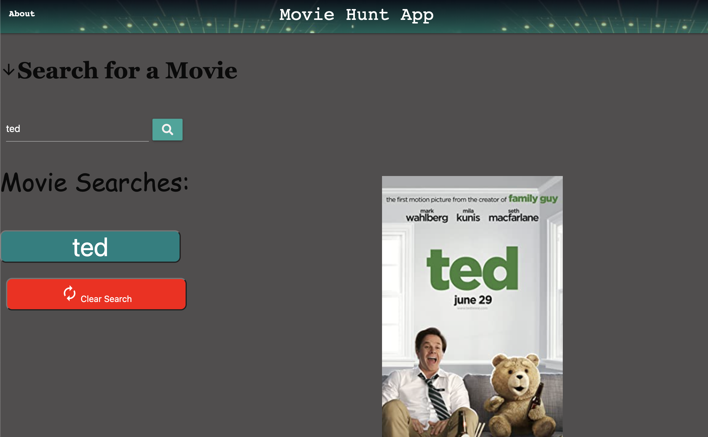
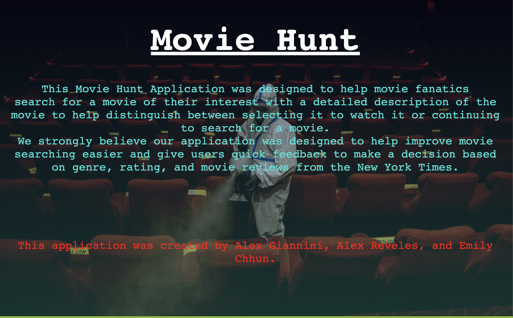

# Movie Hunt App. 

##### Movie hunt is an application where users can input a search of a movie title and receive relevant information. Some of the information returned from the search includes the movie plot, year of release, rating, genre, and movie poster. This will allow users to find the perfect movie to watch, however when an user is unsure of multiple movie searches they can refer back to the movie history and select a previous search to retrieve the relevant information again. This application was made to help those movie fanatics pick the right movie at home during COVID-19.

# Built with:
* html
* css / materialize
* javascript/Jquery
* Server side APIs 

 

##### Contribution: Alex Reveles, Alex Giannini, & Emily Chhun.

###### ©️2021 Movie Hunt App, Inc

